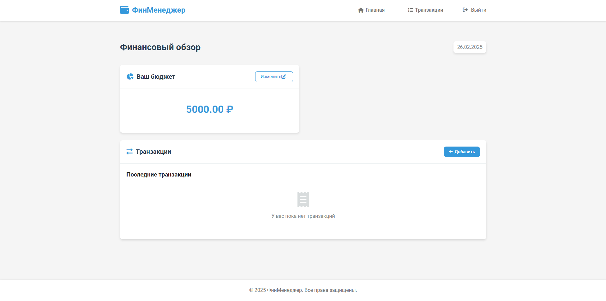
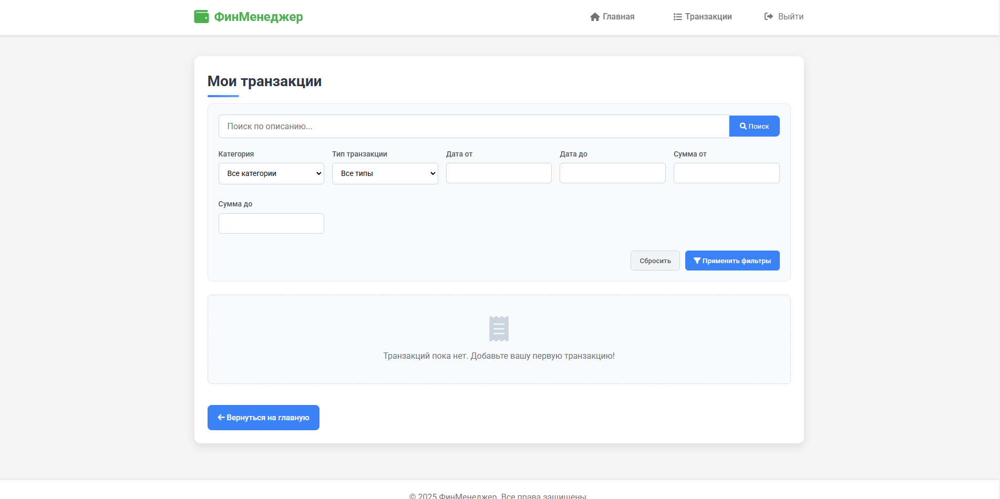

 💼 Финансовый менеджер

### Описание
Приложение для управления финансами, позволяющее пользователям отслеживать доходы и расходы. Интерфейс оформлен с помощью Bootstrap, js, css

 📈 Скриншоты





## ⚡ Установка и запуск

1. **Клонируйте репозиторий:**
   ```sh
   git clone https://github.com/твой-ник/финансы.git
   cd финансы
   ```
2. **Создайте виртуальное окружение и установите зависимости:**
   ```sh
   python -m venv venv
   source venv/bin/activate  # Для Windows: venv\Scripts\activate
   pip install -r requirements.txt
   ```
3. **Настройте переменные окружения (.env):**
   
4. **Запустите сервер:**
   ```sh
   python manage.py runserver
   ```

 📝 Технологии
- **Backend**: Django
- **Frontend**: Bootstrap, HTML, CSS, JS

## 👤 Контакты
Если у вас есть вопросы или предложения, пишите мне в телеграмм: @Exmar1.

